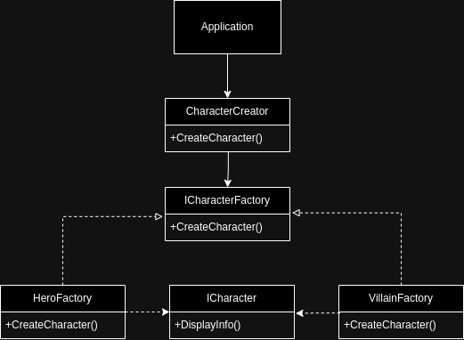

## Desafio
Você está trabalhando em um sistema de personagens, este sistema tem como objetivo trazer as informações do personagem uma vez que informado o tipo do mesmo, neste momento, existem dois tipos de personagens:
<ul>
    <li>heróis</li>
    <li>vilões</li>
</ul>

Foi solicitado que você implemente novos tipos de personagens, como pessoas, porém ao analisar o código foi visto um problema devido a quantidade de ifs encontradas, como você pode resolver a situação, já que temos um problema para criar novos personagens da maneira que está, precisamos que você refatore o código e crie fábricas de super-heróis

    

