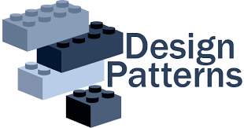
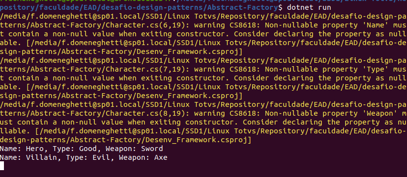

<div style="display: flex; justify-content: center; align-items: center; width: 100%;">
    
</div>


# Desafio Design Patterns
<p id="descricaoprojeto" align="left">Este repositório tem como objetivo trazer códigos com cenários apresentando problemas de arquitetura para que possam ser melhorados através da implementação de desing patterns</p>

## :bookmark_tabs: Tabela de Conteúdo

<ul id="tabelaconteudo" align="left">
  <li><a href="#descricaoprojeto">Descrição do Projeto</a></li>
  <li><a href="#statusprojeto">Status do Projeto</a></li>
  <li><a href="#tabelaconteudo">Tabela de Conteúdo</a></li>
  <li><a href="#rodandoprojeto">Rodando um projeto</a></li>
</ul>

## :rocket: Status do Projeto
<h4 id="statusprojeto" align="left"> 
    Em construção... 
</h4>

## :white_check_mark: Problemas x Cenários
- [x] Abstract Factory
- [ ] Sigleton

## Pré-requisitos

Antes de começar, você vai precisar ter instalado em sua máquina as seguintes ferramentas:
[Git](https://git-scm.com) e [Dotnet 8](https://dotnet.microsoft.com/pt-br/download/dotnet/8.0). 

Além disto é bom ter um editor para trabalhar com o código como [VSCode](https://code.visualstudio.com/)


### 🔨 Rodando o(s) projeto(s)
<p id="#rodandoprojeto"></p>

```bash
# Clone este repositório
$ git clone <path do repositório >

# Acesse a pasta do projeto no terminal/cmd que deseja resolver 
$ cd Abstract-Factory

# Instale as dependências
$ dotnet build

# Execute a aplicação de api em modo de desenvolvimento
$ dotnet run


```
#### O projeto irá rodar através de um terminal apresentado no console um valor proposto pelo código:

<div style="display: flex; justify-content: left; align-items: left; width: 70%;">
    
</div>
